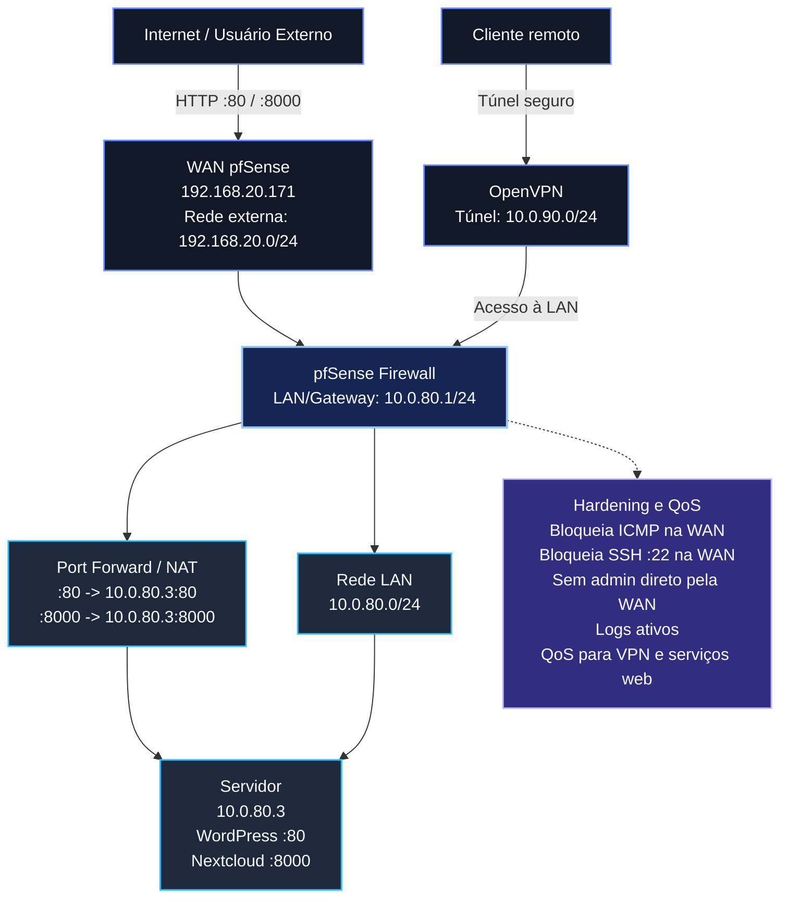

# Relatório Técnico: Infraestrutura de Rede e Segurança com pfSense

## 1. Introdução

Este relatório descreve a implementação de um ambiente de rede seguro utilizando o firewall pfSense. O projeto contempla a configuração de serviços web em um servidor interno, a exposição controlada desses serviços por meio de NAT e o estabelecimento de um túnel VPN seguro para administração remota.

Foram considerados os seguintes objetivos principais:

- Segmentar o tráfego externo e interno entre as interfaces WAN e LAN.
- Publicar os serviços WordPress e Nextcloud hospedados na LAN.
- Permitir acesso administrativo remoto apenas por VPN.
- Aplicar boas práticas de segurança e hardening no firewall.
- Priorizar tráfego sensível com regras de QoS.
- Validar a conectividade por testes externos e internos.

## 2. Topologia de Rede

A infraestrutura foi montada com uma rede segmentada, separando o tráfego externo, recebido pela interface WAN do pfSense, da rede de servidores internos, conectada à interface LAN.

## 3. Endereçamento IP

| Dispositivo | Interface | Endereço IP |
| --- | --- | --- |
| pfSense | WAN | `192.168.20.171` |
| pfSense | LAN / Gateway | `10.0.80.1/24` |
| Servidor | LAN | `10.0.80.3` |
| Rede da VPN | Túnel virtual | `10.0.90.0/24` |

!!! note "Evidência: interfaces do sistema"

    Inserir o print do dashboard do pfSense mostrando o widget **Interfaces**, com WAN e LAN visíveis.

## 4. Configuração de NAT e Firewall

Para disponibilizar os serviços internos à rede externa, foram configuradas regras de Port Forward no pfSense. Essas regras encaminham conexões recebidas na interface WAN para o servidor interno `10.0.80.3`.

### 4.1 Redirecionamento de Portas

| Serviço | Porta externa | Protocolo | Destino interno | Finalidade |
| --- | --- | --- | --- | --- |
| WordPress | `80` | TCP | `10.0.80.3:80` | Publicação do site WordPress |
| Nextcloud | `8000` | TCP | `10.0.80.3:8000` | Publicação do serviço Nextcloud |

!!! note "Evidência: regras de NAT"

    Inserir o print do menu **Firewall > NAT > Port Forward** com as duas regras visíveis.

## 5. Configuração de VPN com OpenVPN

Foi configurada uma VPN do tipo Remote Access para permitir que administradores externos acessem a rede LAN de forma segura. Com esse modelo, o acesso ao ambiente administrativo não depende de exposição direta pela WAN.

| Item | Configuração |
| --- | --- |
| Tipo de VPN | Remote Access |
| Serviço | OpenVPN |
| Rede do túnel | `10.0.90.0/24` |
| Rede acessível pela VPN | `10.0.80.0/24` |
| Gateway interno | `10.0.80.1` |

!!! note "Evidência: status da conexão"

    Inserir o print do menu **Status > OpenVPN**, mostrando o usuário conectado e o serviço em estado **Up**.

!!! note "Evidência: acesso seguro ao dashboard"

    Inserir o print do navegador do computador local acessando `http://10.0.80.1` por meio da VPN.

## 6. Boas Práticas e Segurança

O firewall foi configurado para reduzir a superfície de ataque e aumentar a resiliência contra acessos indevidos, varreduras e tentativas de enumeração vindas da interface WAN.

### 6.1 Bloqueios na Interface WAN

Foram aplicadas as seguintes medidas de hardening:

- Bloqueio de ping ICMP na WAN.
- Bloqueio da porta `22` TCP, impedindo acesso SSH direto pela WAN.
- Desativação de acessos administrativos diretos pela WAN.
- Ativação do bloqueio de redes bogon na interface WAN.
- Registro de logs nas regras de bloqueio relevantes.

!!! note "Evidência: regras de firewall na WAN"

    Inserir o print do menu **Firewall > Rules > WAN**, mostrando as regras de bloqueio e o ícone de log ativo.

### 6.2 Monitoramento e Logs

Os logs do pfSense foram utilizados para acompanhar tentativas de acesso bloqueadas em tempo real. Essa monitoração permite validar se as regras da interface WAN estão funcionando e facilita a identificação de tráfego suspeito.

!!! note "Evidência: logs de bloqueio"

    Inserir o print do menu **Status > System Logs > Firewall**, mostrando os bloqueios em vermelho.

### 6.3 Priorização de Tráfego

Foi configurado o Traffic Shaper para priorizar o tráfego sensível da VPN e dos serviços web. Essa configuração busca reduzir latência durante períodos de maior uso da rede.

| Tráfego | Prioridade esperada | Justificativa |
| --- | --- | --- |
| VPN | Alta | Garante acesso administrativo responsivo |
| WordPress | Média/Alta | Mantém disponibilidade do serviço web público |
| Nextcloud | Média/Alta | Preserva estabilidade para acesso a arquivos |
| Demais fluxos | Normal | Evita competição indevida com serviços críticos |

!!! note "Evidência: QoS"

    Inserir o print do menu **Firewall > Traffic Shaper > By Interface**, mostrando a árvore de filas ou queues.

## 7. Testes de Conectividade

Os testes foram separados entre acessos externos, realizados sem VPN, e acessos internos, realizados por meio do túnel VPN.

### 7.1 Testes Externos sem VPN

| Teste | Endereço | Resultado esperado |
| --- | --- | --- |
| Acesso ao WordPress | `http://192.168.20.171` | Página do WordPress carregada |
| Acesso ao Nextcloud | `http://192.168.20.171:8000` | Página do Nextcloud carregada |

!!! note "Evidência: WordPress"

    Inserir o print do navegador acessando `http://192.168.20.171`.

!!! note "Evidência: Nextcloud"

    Inserir o print do navegador acessando `http://192.168.20.171:8000`.

### 7.2 Testes Internos com VPN

| Teste | Comando ou endereço | Resultado esperado |
| --- | --- | --- |
| Ping ao servidor interno | `ping 10.0.80.3` | Respostas ICMP pelo túnel VPN |
| Acesso ao gateway pfSense | `http://10.0.80.1` | Dashboard acessível pela VPN |

!!! note "Evidência: ping via túnel"

    Inserir o print do terminal mostrando sucesso no `ping 10.0.80.3` através da VPN.

## 8. Conclusão

A implementação demonstrou a criação de uma infraestrutura segmentada e protegida com pfSense, combinando NAT, regras de firewall, VPN de acesso remoto, logs de segurança e priorização de tráfego. A exposição dos serviços WordPress e Nextcloud foi realizada de forma controlada, enquanto o acesso administrativo ficou restrito ao túnel VPN.

Os principais pontos consolidados no projeto foram:

- Separação clara entre WAN, LAN e rede VPN.
- Publicação controlada de serviços internos por Port Forward.
- Acesso administrativo remoto protegido por OpenVPN.
- Bloqueio de tráfego administrativo e diagnóstico diretamente pela WAN.
- Uso de logs para validar o comportamento das regras de segurança.
- Aplicação de QoS para reduzir impacto de picos de uso.

!!! question "Discussão do grupo"

    Completar esta seção com os desafios encontrados durante a configuração, dificuldades de teste, problemas de conectividade e aprendizados obtidos ao longo do roteiro.
