# Relatório Técnico: Infraestrutura de Rede e Segurança com pfSense

## 1. Introdução

Este relatório descreve a implementação de um ambiente de rede seguro utilizando o firewall pfSense. O projeto contempla a configuração de serviços web em um servidor interno, a exposição controlada desses serviços por meio de NAT e o estabelecimento de um túnel VPN seguro para administração remota.

Foram considerados os seguintes objetivos principais:

- Segmentar o tráfego externo e interno entre as interfaces WAN e LAN.
- Publicar os serviços WordPress e Nextcloud hospedados na LAN.
- Permitir acesso administrativo remoto apenas por VPN.
- Aplicar boas práticas de segurança e hardening no firewall.
- Priorizar tráfego sensível com regras de QoS.
- Validar a conectividade por testes externos e internos.

### 1.1 Estrutura do ambiente

Para a execução do roteiro, o grupo recebeu:

• 1 Firewall PfSense instalado em máquina física ou virtual;

• 1 Host Servidor (Linux);

• 1 Máquina cliente (opcional, para testes de acesso e VPN).

<strong>Firewall PfSense e Host Servidor usados em laboratório</strong>

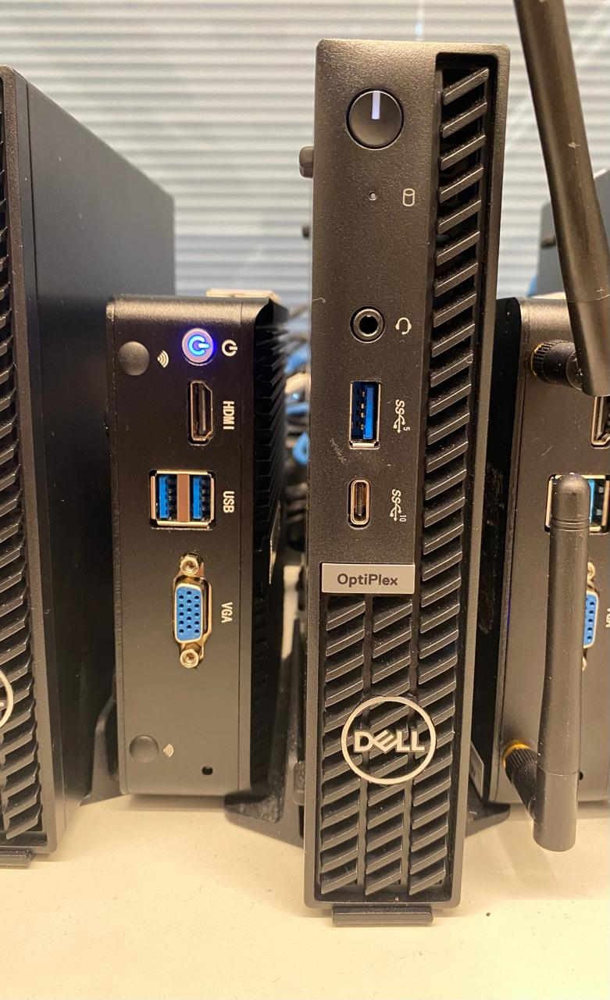

### 1.2 Restabelecimento do pfSense para Factory Defaults

Antes de iniciar a configuração da rede, o equipamento pfSense foi restaurado para as configurações de fábrica para garantir um ambiente limpo.

O procedimento realizado foi:

- Selecionar a opção `4) Reset to factory defaults` no menu principal do console.
- Confirmar a restauração respondendo `y` à mensagem de confirmação.
- Ignorar a configuração de VLANs, respondendo `n` quando solicitado.
- Atribuir as interfaces de rede manualmente:
  - `WAN` -> `igc0`
  - `LAN` -> `igc1`
  - `OPT1` -> `igc2`
  - `OPT2` -> `igc3`
- Confirmar a atribuição de interfaces e permitir que o pfSense reinicie.

Após o reboot, a interface LAN passou a responder na rede interna padrão e o acesso ao webConfigurator foi verificado pelo endereço `https://192.168.1.1`.

<strong>Evidência: restauração para factory defaults</strong>

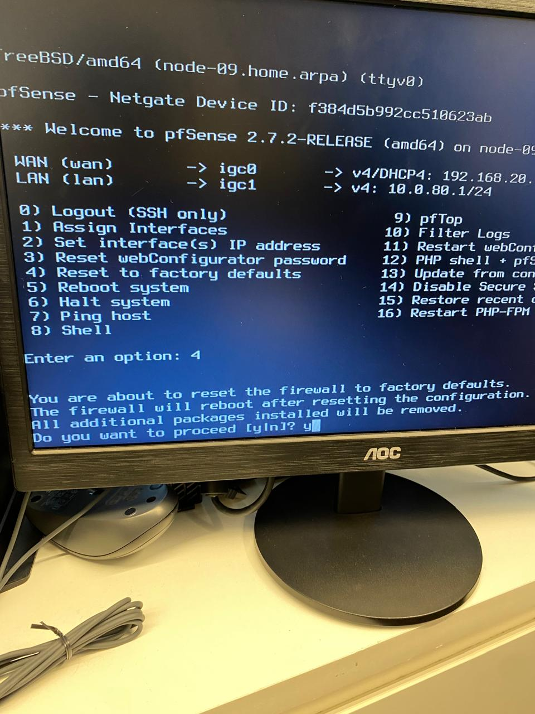

<strong>Evidência: atribuição de interfaces</strong>

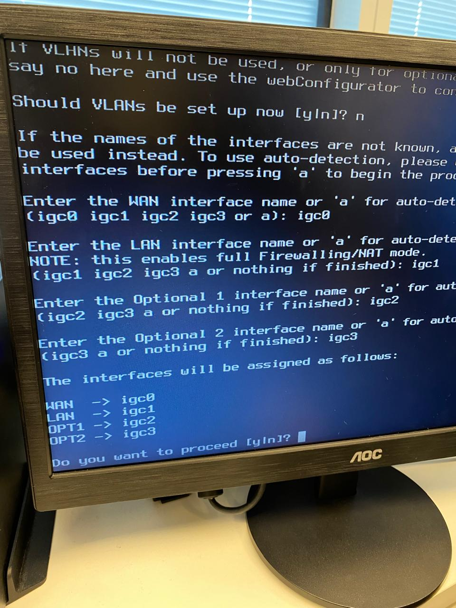

<strong>Evidência: Tela de login do pfSense no IP 192.168.1.1 (factory default)</strong>

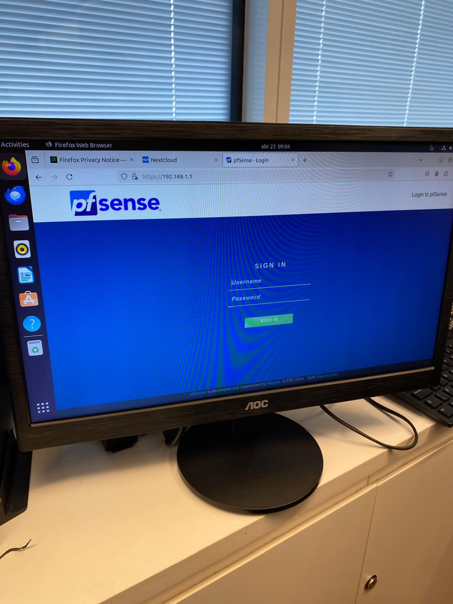

O login no pfSense foi realizado com sucesso usando as credenciais padrão `admin` / `pfsense`. Após autenticar, a interface LAN foi reconfigurada para o endereço `10.0.80.1/24`, alinhando o gateway ao plano de endereçamento interno do projeto.

<strong>Evidência: reconfiguração do IP para 10.0.80.1/24</strong>

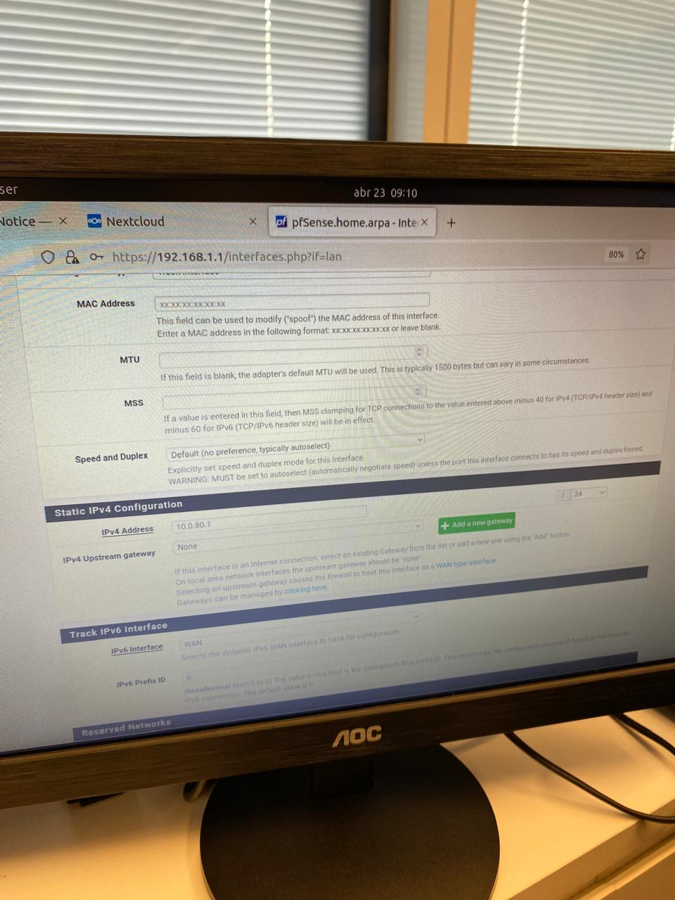

## 2. Topologia de Rede

A infraestrutura foi montada com uma rede segmentada, separando o tráfego externo, recebido pela interface WAN do pfSense, da rede de servidores internos, conectada à interface LAN.

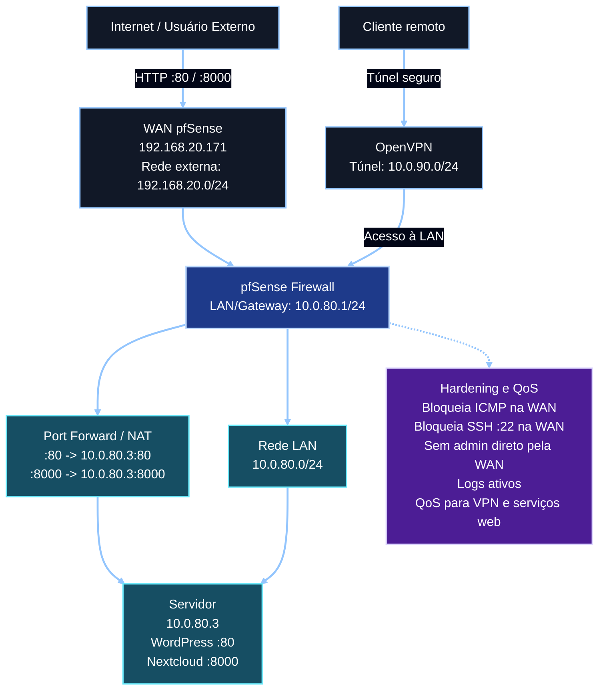
```mermaid
%%{init: {"theme": "base", "themeCSS": ".nodeLabel,.nodeLabel *,.label,.label *,.edgeLabel,.edgeLabel *{color:#ffffff!important}.label text,text{fill:#ffffff!important}.edgeLabel,.edgeLabel span,.edgeLabel div,.edgeLabel p,.labelBkg{background-color:#020617!important;fill:#020617!important}.flowchart-link,marker path{stroke:#93c5fd!important}", "flowchart": {"htmlLabels": true, "curve": "basis"}, "themeVariables": {"background": "#020617", "edgeLabelBackground": "#020617", "fontFamily": "Arial, sans-serif", "fontSize": "16px", "lineColor": "#93c5fd", "nodeTextColor": "#ffffff", "primaryTextColor": "#ffffff", "textColor": "#ffffff"}} }%%
flowchart TB
    external["Internet / Usuário Externo"]
    wan["WAN pfSense<br/>192.168.20.171<br/>Rede externa: 192.168.20.0/24"]
    pfsense["pfSense Firewall<br/>LAN/Gateway: 10.0.80.1/24"]
    nat["Port Forward / NAT<br/>:80 -> 10.0.80.3:80<br/>:8000 -> 10.0.80.3:8000"]
    lan["Rede LAN<br/>10.0.80.0/24"]
    server["Servidor<br/>10.0.80.3<br/>WordPress :80<br/>Nextcloud :8000"]
    remote["Cliente remoto"]
    vpn["OpenVPN<br/>Túnel: 10.0.90.0/24"]
    rules["Hardening e QoS<br/>Bloqueia ICMP na WAN<br/>Bloqueia SSH :22 na WAN<br/>Sem admin direto pela WAN<br/>Logs ativos<br/>QoS para VPN e serviços web"]

    external -->|"HTTP :80 / :8000"| wan
    wan --> pfsense
    pfsense --> nat
    nat --> server
    pfsense --> lan
    lan --> server

    remote -->|"Túnel seguro"| vpn
    vpn -->|"Acesso à LAN"| pfsense
    pfsense -.-> rules

    linkStyle default stroke:#93c5fd,stroke-width:2.4px,color:#ffffff

    classDef endpoint fill:#111827,stroke:#93c5fd,color:#ffffff,stroke-width:1.6px
    classDef firewall fill:#1e3a8a,stroke:#bfdbfe,color:#ffffff,stroke-width:2px
    classDef service fill:#164e63,stroke:#67e8f9,color:#ffffff,stroke-width:1.6px
    classDef control fill:#4c1d95,stroke:#ddd6fe,color:#ffffff,stroke-width:1.6px

    class external,wan,remote,vpn endpoint
    class pfsense firewall
    class lan,server,nat service
    class rules control
```

## 3. Endereçamento IP

| Dispositivo | Interface | Endereço IP |
| --- | --- | --- |
| pfSense | WAN | `192.168.20.171` |
| pfSense | LAN / Gateway | `10.0.80.1/24` |
| Servidor | LAN | `10.0.80.3` |
| Rede da VPN | Túnel virtual | `10.0.90.0/24` |

<strong>Evidência: interfaces do sistema</strong>

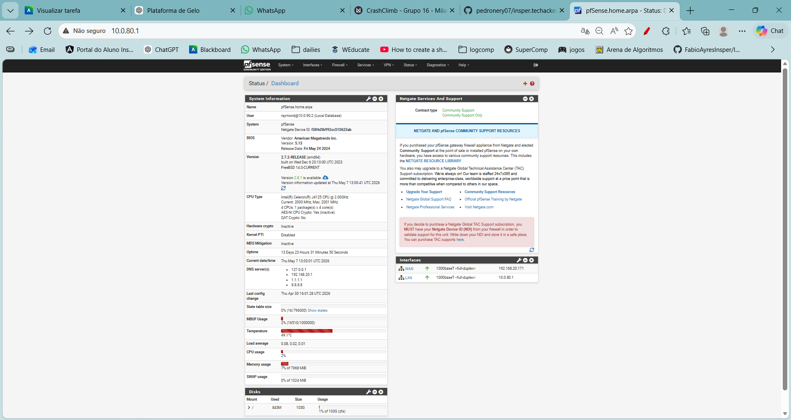

## 4. Configuração de NAT e Firewall

Para disponibilizar os serviços internos à rede externa, foram configuradas regras de Port Forward no pfSense. Essas regras encaminham conexões recebidas na interface WAN para o servidor interno `10.0.80.3`.

### 4.1 Redirecionamento de Portas

| Serviço | Porta externa | Protocolo | Destino interno | Finalidade |
| --- | --- | --- | --- | --- |
| WordPress | `80` | TCP | `10.0.80.3:80` | Publicação do site WordPress |
| Nextcloud | `8000` | TCP | `10.0.80.3:8000` | Publicação do serviço Nextcloud |

<strong>Evidência: Regras de NAT</strong>

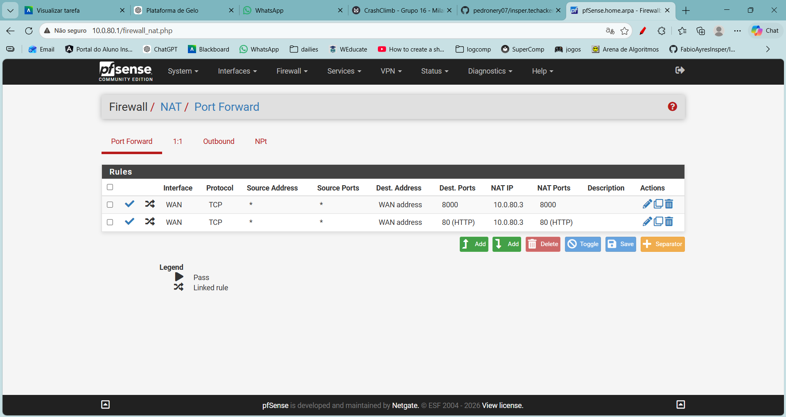

## 5. Configuração de VPN com OpenVPN

Foi configurada uma VPN do tipo Remote Access para permitir que administradores externos acessem a rede LAN de forma segura. Com esse modelo, o acesso ao ambiente administrativo não depende de exposição direta pela WAN.

| Item | Configuração |
| --- | --- |
| Tipo de VPN | Remote Access |
| Serviço | OpenVPN |
| Rede do túnel | `10.0.90.0/24` |
| Rede acessível pela VPN | `10.0.80.0/24` |
| Gateway interno | `10.0.80.1` |

<strong>Evidência: Status da Conexão do VPN por Computador Local </strong>

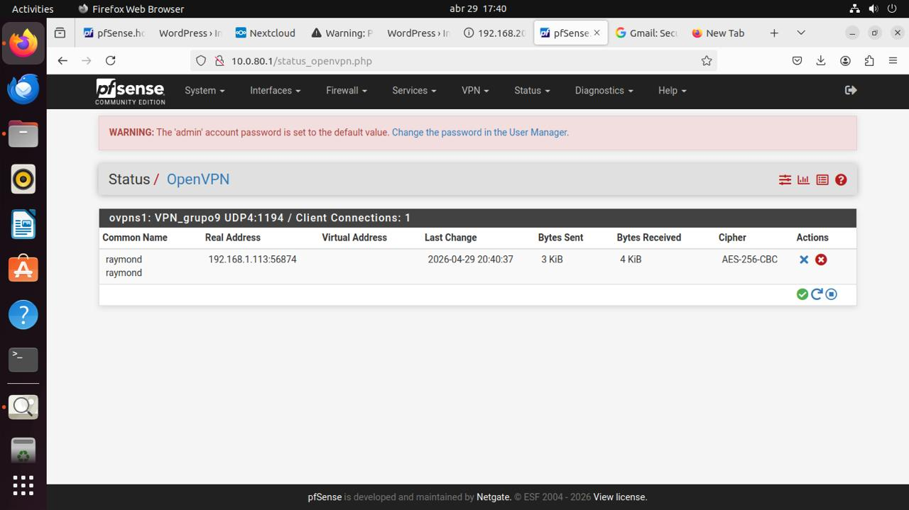

## 6. Boas Práticas e Segurança

O firewall foi configurado para reduzir a superfície de ataque e aumentar a resiliência contra acessos indevidos, varreduras e tentativas de enumeração vindas da interface WAN.

### 6.1 Bloqueios na Interface WAN

Foram aplicadas as seguintes medidas de hardening:

- Bloqueio de ping ICMP na WAN.
- Bloqueio da porta `22` TCP, impedindo acesso SSH direto pela WAN.
- Desativação de acessos administrativos diretos pela WAN.
- Ativação do bloqueio de redes bogon na interface WAN.
- Registro de logs nas regras de bloqueio relevantes.

<strong>Evidência: Regras de Firewall na WAN </strong>

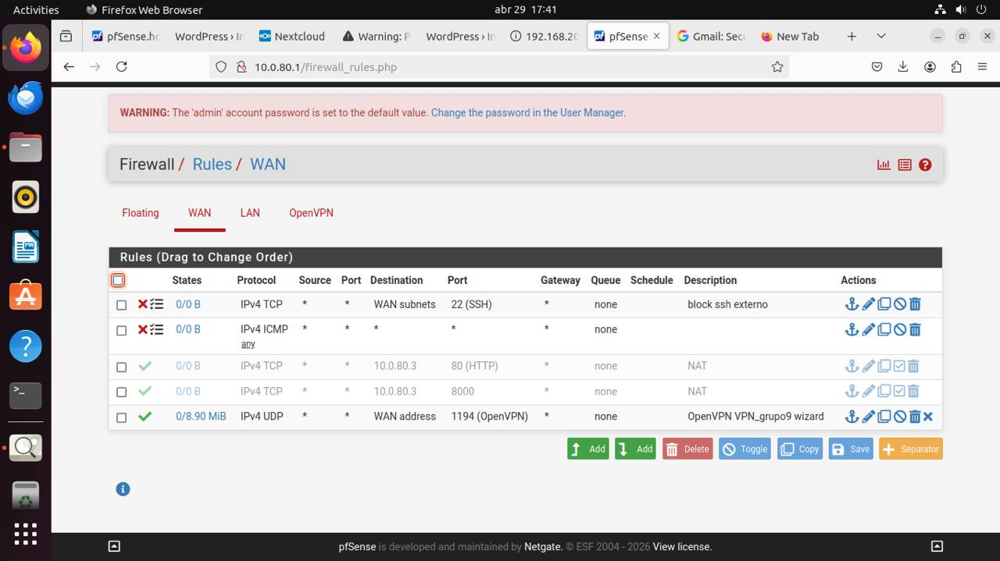

### 6.2 Monitoramento e Logs

Os logs do pfSense foram utilizados para acompanhar tentativas de acesso bloqueadas em tempo real. Essa monitoração permite validar se as regras da interface WAN estão funcionando e facilita a identificação de tráfego suspeito.

<strong>Evidência: Logs de Bloqueio </strong>

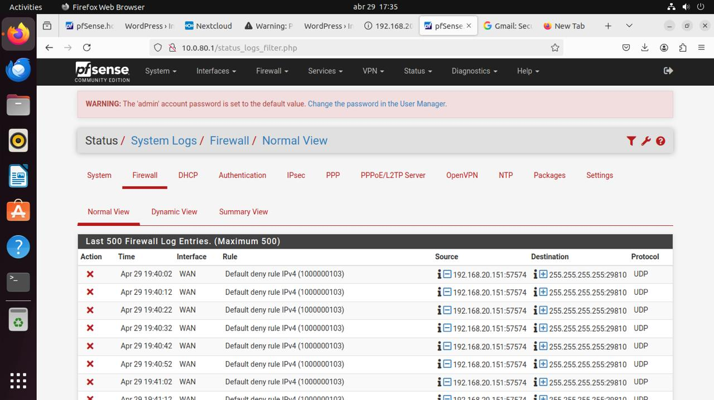

### 6.3 Priorização de Tráfego

Foi configurado o Traffic Shaper para priorizar o tráfego sensível da VPN e dos serviços web. Essa configuração busca reduzir latência durante períodos de maior uso da rede.

| Tráfego | Prioridade esperada | Justificativa |
| --- | --- | --- |
| VPN | Alta | Garante acesso administrativo responsivo |
| WordPress | Média/Alta | Mantém disponibilidade do serviço web público |
| Nextcloud | Média/Alta | Preserva estabilidade para acesso a arquivos |
| Demais fluxos | Normal | Evita competição indevida com serviços críticos |

<strong>Evidência: Traffic Shaper</strong>

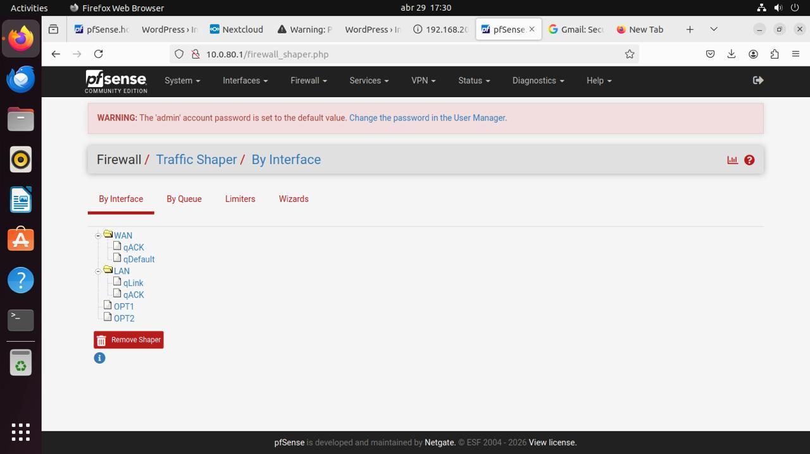

## 7. Testes de Conectividade

Os testes foram separados entre acessos externos, realizados sem VPN, e acessos internos, realizados por meio do túnel VPN.

### 7.1 Testes Externos sem VPN

| Teste | Endereço | Resultado esperado |
| --- | --- | --- |
| Acesso ao WordPress | `http://192.168.20.171` | Página do WordPress carregada |
| Acesso ao Nextcloud | `http://192.168.20.171:8000` | Página do Nextcloud carregada |

### 7.2 Testes Internos com VPN

| Teste | Endereço | Resultado esperado |
| --- | --- | --- |
| Acesso ao WordPress | `http://10.0.80.3` | Página do WordPress carregada |
| Acesso ao Nextcloud | `http://10.0.80.3:8000` | Página do Nextcloud carregada ||

<strong>Evidência: Acesso ao WordPress e NextCloud </strong>

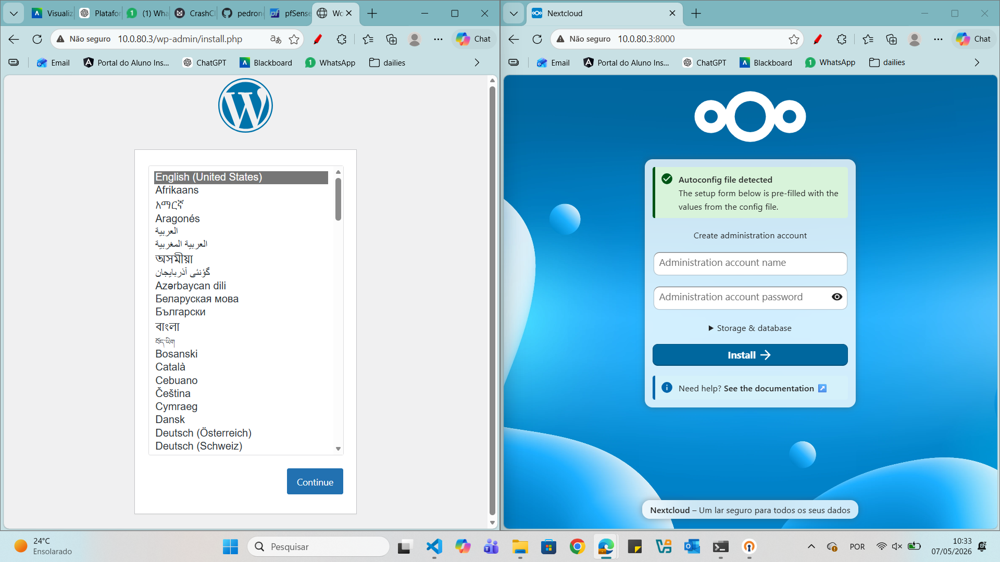

## 8. Conclusão

A implementação demonstrou a criação de uma infraestrutura segmentada e protegida com pfSense, combinando NAT, regras de firewall, VPN de acesso remoto, logs de segurança e priorização de tráfego. A exposição dos serviços WordPress e Nextcloud foi realizada de forma controlada, enquanto o acesso administrativo ficou restrito ao túnel VPN.

Os principais pontos consolidados no projeto foram:

- Separação clara entre WAN, LAN e rede VPN.
- Publicação controlada de serviços internos por Port Forward.
- Acesso administrativo remoto protegido por OpenVPN.
- Bloqueio de tráfego administrativo e diagnóstico diretamente pela WAN.
- Uso de logs para validar o comportamento das regras de segurança.
- Aplicação de QoS para reduzir impacto de picos de uso.
